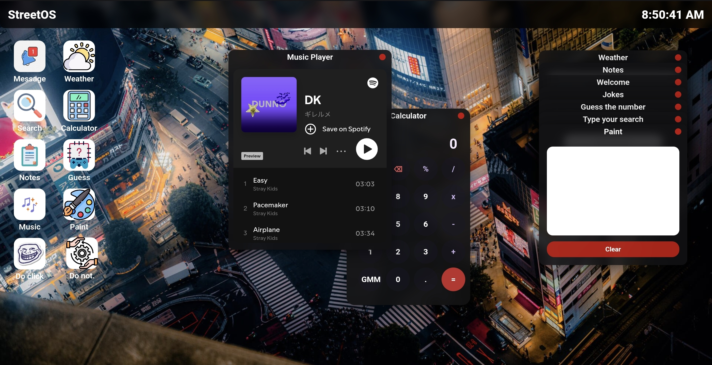

# StreetOS

An OS made by me to stardance hack club. I really like street style, and I think tokyo represents this style a lot, so that was my inspiration.

## Features
- There is a easter egg: remove every icon to change the UI a bit
- Paint and a jokes app
- Weather of any city you want
- A little game: guess-the-number
- Simple apps: calculator, notes and search
- A music player (with a playlist that I like)

### UI details
- Glass-style windows and bars
- Draggable windows and icons
- Loading screen
- Icons lift

#### HTML - Java Script - CSS

